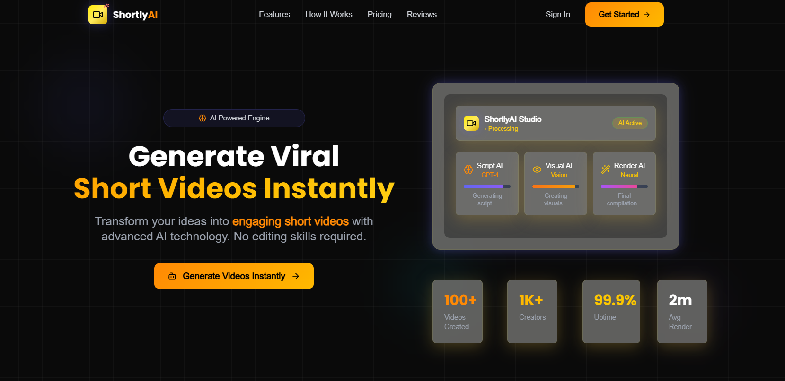
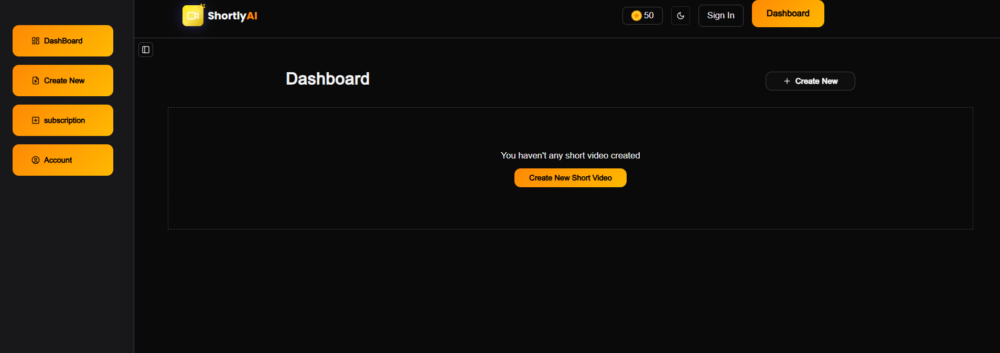
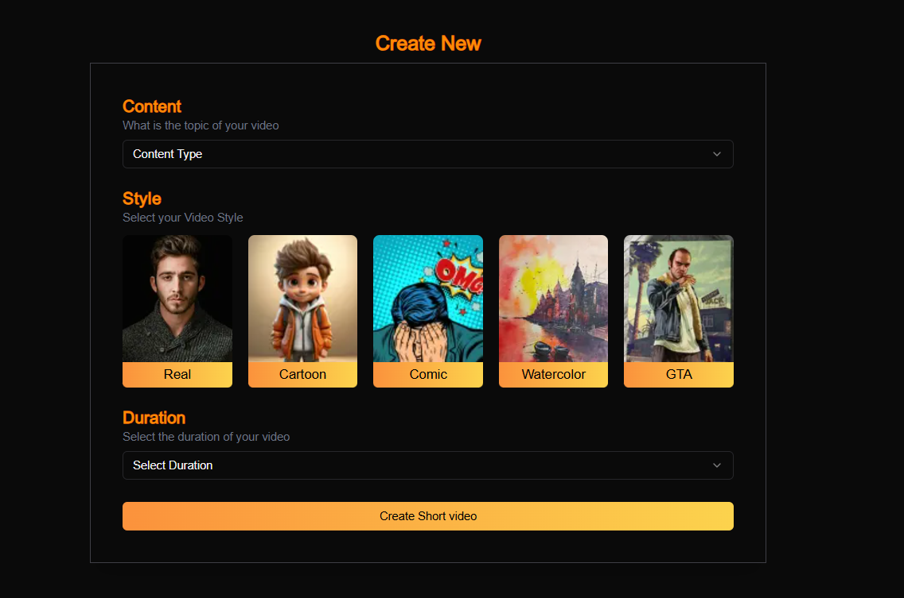

# 🎥 ShortlyAI – AI-Powered Short Video Generator

ShortlyAI is a fullstack SaaS application that lets users generate **viral short videos instantly** using a 3-stage AI pipeline: **Script AI → Visual AI → Render AI**.

Built for creators, marketers, and founders who want to convert ideas into engaging short-form content — without editing skills or complex tools.

---

## 🌐 Live Demo

🔗 [[https://shortlyai.vercel.app](https://shortlyai.vercel.app) ](https://shortly-ai-wc8p.vercel.app/)

> ⚠️ Note: This project is actively under development. Occasional errors may occur while generating content — fixes are in progress.

---

## 📸 Screenshots

### Landing Page  


### Dashboard  


### Video Creation  


### Video Created

---

## 🚀 Features

- ✅ Modern landing page with CTA
- ✅ Authenticated dashboard using **NextAuth**
- ✅ Select content type & video style (Real, Cartoon, Comic, Watercolor, GTA)
- ✅ AI Pipeline:
  - ✍️ **Script AI** (OpenAI GPT-4)
  - 👁️ **Visual AI** (image generation engine)
  - 🎞️ **Render AI** (final video composition)
- ✅ Video history stored per user
- ✅ Room for upgrade: Stripe integration, analytics, export options
- ✅ full responsive can use in Mobiles, tablets, laptops.

---

## 🛠 Tech Stack

| Layer | Tools Used |
|-------|-------------|
| 🧠 AI | GEMINI , Assembly / Replicate |
| 🌐 Frontend | Next.js 14, TailwindCSS, Shadcn/UI |
| 🧪 Backend | Node.js, Next.js API routes |
| 🔐 Auth | NextAuth.js |
| 🗃️ Database | Prisma + PostgreSQL |
| ☁️ Deployment | Vercel  |

---

## 🧠 How It Works

1. User logs in and clicks **“Generate Video”**
2. Gemini generates a short script based on input
3. Genrates a audio using this script.(via MurfAI)
4. Based on that Audio creates a Captions. (via AssemblyAI)
3. Visuals are created using selected style (via ReplicateAI)
4. Render AI compiles everything into a downloadable short video
5. Video is stored and shown on the user's dashboard
---

## 🧪 Local Setup

```bash
git clone https://github.com/HiteshCodesl/ShortlyAi.git
cd videogenerator
pnpm install
cp .env.example .env.local # add your OpenAI & DB keys
pnpm run dev
